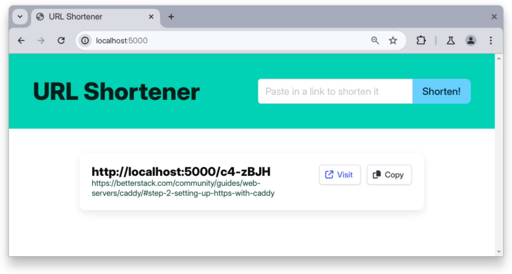

# URL Shortener
# URL Shortener

A URL Shortener Application built with Node.js, Fastify and PostgreSQL. See the
[final branch](https://github.com/finallyayo/node-url-shortener/tree/fastify)
for the updated code with Docker configuration.

**Tutorial**:
[A Comprehensive Guide to Dockerizing Node.js Applications](https://betterstack.com/community/guides/scaling-nodejs/dockerize-nodejs/)

## 🟢 Prerequisites

- Prior Node.js development experience.
- Familiarity with the Linux command-line.
- Access to a Linux machine with
  [Docker Engine](https://docs.docker.com/engine/install/) installed.

## Getting started

Find the set up instructions in
[step 1 of the article](https://betterstack.com/community/guides/scaling-nodejs/dockerize-nodejs/#step-1-setting-up-the-demo-project).

## How to use

- Enter a URL into the input field and click **Shorten!**. The shortened URL
  will be displayed on the page.
- Click the **Visit** button to open the shortened URL in a new tab. It should
  redirect you to the original URL.
